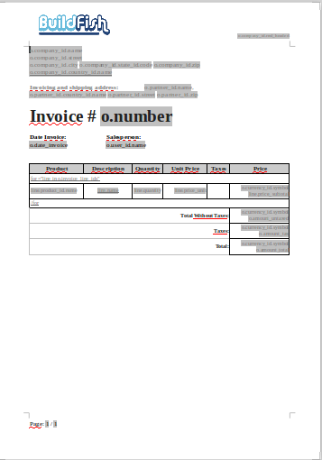
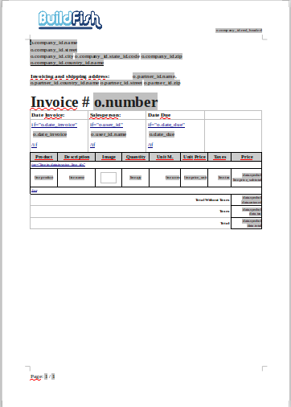
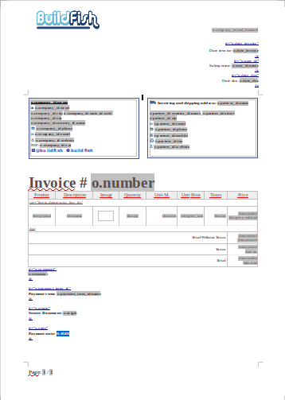
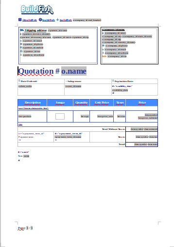
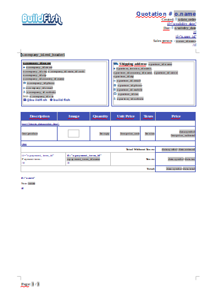
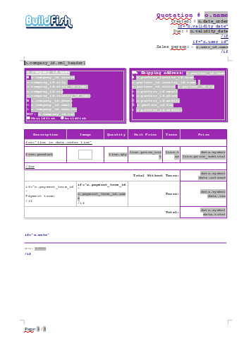

### Sample templates for the report_extend_bf module
Depends module: report_extend_bf

Create any objets report is easy with report_extend_bf
Output formats:

    ODF Text Document [.odt]
    ODF Spreadsheet [.ods]
    Microsoft Word 97/2000/XP [.doc]
    Microsoft Office Open XML [.docx]
    Portable Document Format [.pdf]

Example any objects
account.invoice
 

 

sale.order

 

 

res.partner

