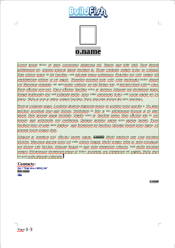

### Sample templates for the report_extend_bf module
Depends module: report_extend_bf

Create any objets report is easy with report_extend_bf

Output formats:

    ODF Text Document [.odt]
    ODF Spreadsheet [.ods]
    Microsoft Word 97/2000/XP [.doc]
    Microsoft Office Open XML [.docx]
    Portable Document Format [.pdf]

Example any objects, templates

account.invoice             |  account.invoice
:-------------------------:|:-------------------------:
  |  
  |

sale.order             |  sale.order
:-------------------------:|:-------------------------:
  |  
  |  

res.partner                     |  res.partner
:-------------------------:|:-------------------------:
  |